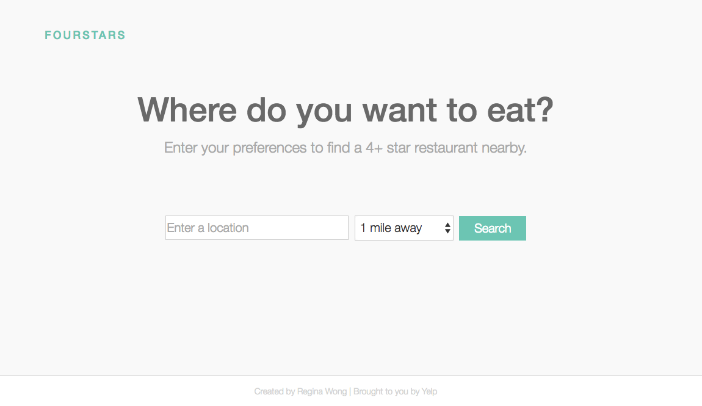
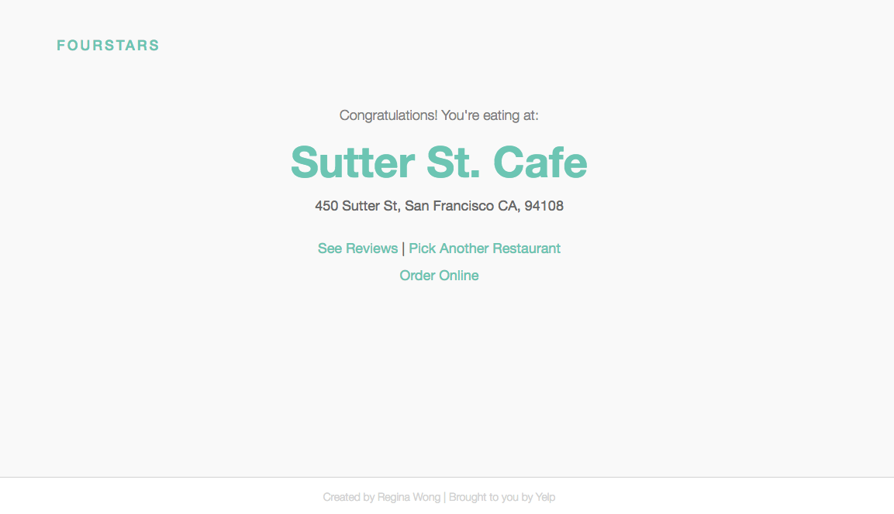

Yelp App

Heroku: https://quiet-depths-30248.herokuapp.com/

# 
# Yelp App
> Solution for all indecisive foodies

Whenever I or my friends make plans to go out for dinner, we have a hard time deciding where to go.

I created a web app that takes away the responsiblity of decision making by generating a highly-rated restaurant choice (4 stars or above) for indecisive people.

####[My Blog Post](https://http://iregina.github.io/portfolio/yelp.html)

## Team

My team composed of:

#### [Regina Wong](https://github.com/iregina/) - Full-Stack Web Developer

Regina has been working in technology companies for the past two years. She designed, implemented, and deployed websites from initial design and architecture through development and deployment. She was in charge of JSON and web API integration.

## Technologies

Yelp API, Google Maps Geocoding, HTML5/CSS, Bootstrap

## Screenshots

## License

Everything in this repo is MIT License unless otherwise specified.

MIT © Regina Wong, Sean Yang.